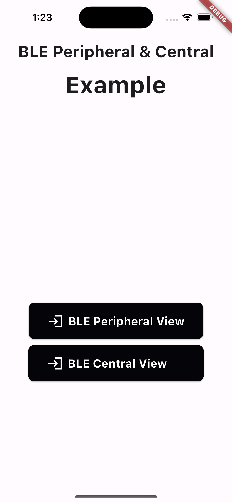
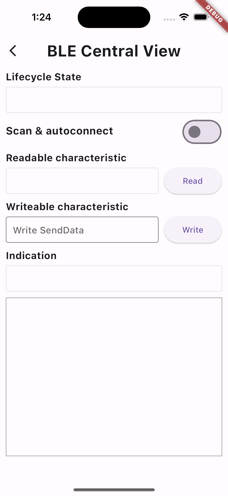
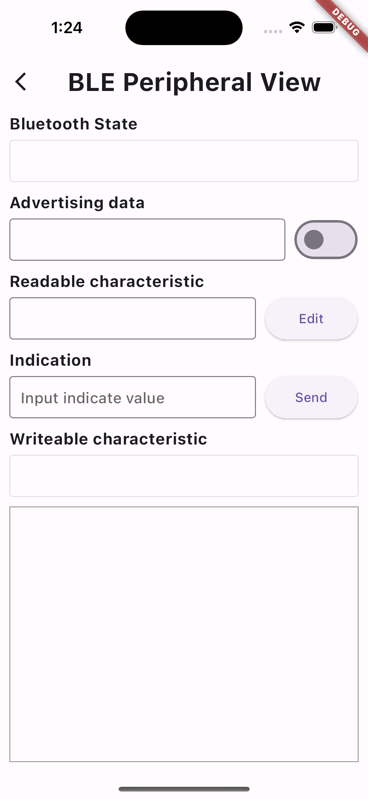

# flutter_ble_test

## 1. BLE Peripheral Central Example

"BLE Peripheral Central Example is a sample that utilizes the flutter_ble_peripheral_central and permission_handler"

## 2. Screenshots

| Home                                       | BLE Central                                       | BLE Peripheral                                     |
|--------------------------------------------|---------------------------------------------------|----------------------------------------------------|
|         |       |  |

## 3. Plugin Install

1) flutter_ble_peripheral_central
 ````xml
  $ flutter pub add flutter_ble_peripheral_central    
 ````
   
   or

 ````xml
  dependencies:
     flutter_ble_peripheral_central: ^0.0.5    
 ````

2) permisson_handler
````xml
  $ flutter pub add permission_handler    
````

   or

````xml
 dependencies:
     permission_handler: ^10.4.5
````

## 4. Setup
**Android**

1) Add permission to your `AndroidManifest.xml`.
   ````xml
    <uses-permission android:name="android.permission.BLUETOOTH" />
    <uses-permission android:name="android.permission.BLUETOOTH_ADMIN" />
    <uses-permission android:name="android.permission.BLUETOOTH_SCAN" android:usesPermissionFlags="neverForLocation" />
    <uses-permission android:name="android.permission.BLUETOOTH_ADVERTISE" />
    <uses-permission android:name="android.permission.BLUETOOTH_CONNECT" />
    <uses-feature android:name="android.hardware.bluetooth" android:required="true"/>
    <uses-feature android:name="android.hardware.bluetooth_le" android:required="true"/>
    <uses-permission android:name="android.permission.ACCESS_BACKGROUND_LOCATION" />
    <uses-permission android:name="android.permission.ACCESS_FINE_LOCATION" />
    <uses-permission android:name="android.permission.ACCESS_COARSE_LOCATION" />
   ````

2) Register peripheral service to your `AndroidManifest.xml`.
   ````xml
    <service android:name="com.novice.flutter_ble_peripheral_central.ble.BlePeripheralService"
             android:exported="true"
             android:enabled="true"
             android:permission="android.permission.BLUETOOTH">
    </service>
   ````

3) Register central service to your `AndroidManifest.xml`.
   ````xml
    <service android:name="com.novice.flutter_ble_peripheral_central.ble.BleCentralService"
             android:exported="true"
             android:enabled="true"
             android:permission="android.permission.BLUETOOTH_ADMIN">
        <intent-filter>
            <action android:name="android.bluetooth.adapter.action.STATE_CHANGED" />
        </intent-filter>
    </service>
   ````

**Ios**

* For iOS it is required you add the following entries to the Info.plist file of your app. It is not allowed to access Core BLuetooth without this.

    ````xml
    <key>NSBluetoothAlwaysUsageDescription</key>
    <string>We use Bluetooth to show basic communication between Central and Peripheral</string>
    <key>NSBluetoothPeripheralUsageDescription</key>
    <string>We use Bluetooth to show basic communication between Central and Peripheral</string>
    ````

## - Reference -
* flutter_ble_peripheral_central plugin: https://pub.dev/packages/flutter_ble_peripheral_central
* permisson_handler plugin: https://pub.dev/packages/permission_handler
